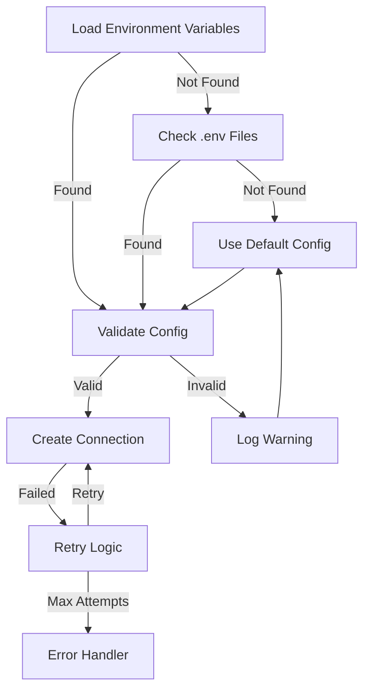

# Technical Architecture

## System Architecture

The Railway Operations Management System follows a modern full-stack architecture with clear separation of concerns:

### Frontend Architecture
```
client/
├── src/
│   ├── components/     # Reusable UI components
│   ├── hooks/         # Custom React hooks
│   ├── lib/           # Utility functions and API clients
│   └── pages/         # Main application pages
```

### Backend Architecture
```
server/
├── routes.ts          # API route definitions
├── auth.ts           # Authentication logic
├── websocket.ts      # Real-time updates handling
└── vite.ts          # Development server configuration

db/
├── schema.ts         # Database schema definitions
└── index.ts         # Database connection and initialization
```

## Data Flow

1. **Authentication Flow**
   - User credentials → Passport.js → Database validation → JWT session
   - Session maintenance through express-session
   - Role-based access control for API endpoints

2. **Real-time Updates Flow**
```mermaid
graph TD
    A[Client] -->|Connect| B[WebSocket Server]
    B -->|Connection Established| C[Subscribe to Updates]
    
    subgraph Connection Management
### Data Import/Export Flow
```mermaid
graph TD
    A[Excel File] -->|Upload| B[Import Handler]
    B -->|Parse Excel| C[Data Validation]
    C -->|Valid Data| D[Map to Schema]
    D -->|Transform| E[Database Operations]
    E -->|Success| F[Update UI]
    E -->|Error| G[Show Error]
    C -->|Invalid Data| H[Error Response]
    
    subgraph Data Validation
        I[Check Required Fields]
        J[Validate Data Types]
        K[Verify References]
        I --> J
        J --> K
    end
    
    subgraph Database Operations
        L[Begin Transaction]
        M[Insert Records]
        N[Commit/Rollback]
        L --> M
        M --> N
    end
```
        B -->|Connection Lost| D[Reconnection Logic]
        D -->|Retry| B
        D -->|Max Attempts| E[Show Error]
    end

    subgraph Schedule Updates
        F[User Action] -->|Update Schedule| G[Optimistic UI Update]
        G -->|Emit updateSchedule| B
        B -->|Broadcast scheduleUpdated| H[Connected Clients]
        H -->|Update React Query Cache| I[UI Refresh]
        
        J[Update Failed] -->|Revert Optimistic Update| K[Invalidate Cache]
        K -->|Fetch Fresh Data| I
    end
</mermaid>

3. **Data Management Flow**
   - API requests → Express routes → Database operations
   - Schedule updates → WebSocket broadcasts → Client updates
   - Excel import → Data validation → Batch database insertion
   - Schedule validation → Conflict detection → Error handling
   - Form validation → Date conversion → Database operations
   - Real-time updates → Optimistic UI → WebSocket sync

## Database Schema

### Users Table
```sql
CREATE TABLE users (
  id SERIAL PRIMARY KEY,
  username TEXT NOT NULL UNIQUE,
  password TEXT NOT NULL,
  role TEXT NOT NULL DEFAULT 'viewer',
  created_at TIMESTAMP DEFAULT CURRENT_TIMESTAMP
);
```

### Trains Table
```sql
CREATE TABLE trains (
  id SERIAL PRIMARY KEY,
  train_number TEXT NOT NULL UNIQUE,
  description TEXT,
  type TEXT NOT NULL DEFAULT 'local'
);
```

### Locations Table
```sql
CREATE TABLE locations (
  id SERIAL PRIMARY KEY,
  name TEXT NOT NULL,
  code TEXT NOT NULL UNIQUE
);
```

### Schedules Table
```sql
CREATE TABLE schedules (
  id SERIAL PRIMARY KEY,
  train_id INTEGER REFERENCES trains(id),
  departure_location_id INTEGER REFERENCES locations(id),
  arrival_location_id INTEGER REFERENCES locations(id),
  scheduled_departure TIMESTAMP NOT NULL,
  scheduled_arrival TIMESTAMP NOT NULL,
  actual_departure TIMESTAMP,
  actual_arrival TIMESTAMP,
  status TEXT NOT NULL DEFAULT 'scheduled',
  is_cancelled BOOLEAN NOT NULL DEFAULT false
);
```


### Configuration Management

The system implements a robust configuration management system with the following features:

1. **Multiple Configuration Sources**
   - Environment variables
   - Configuration files (.env)
   - Default fallback values

2. **Database Configuration**
   - Connection pooling
   - Automatic retry mechanism
   - Fallback configuration
   - Health monitoring

3. **Configuration Flow**


## Performance Considerations

1. **Database Optimization**
   - Indexed fields: train_number, location codes
   - Foreign key constraints for referential integrity
   - Connection pooling for better resource utilization

2. **Real-time Updates**
   - WebSocket connection management
   - Reconnection strategy with exponential backoff
   - Optimistic UI updates for better UX

3. **Security Measures**
   - Password hashing with scrypt
   - Role-based access control
   - Session management
   - CSRF protection
