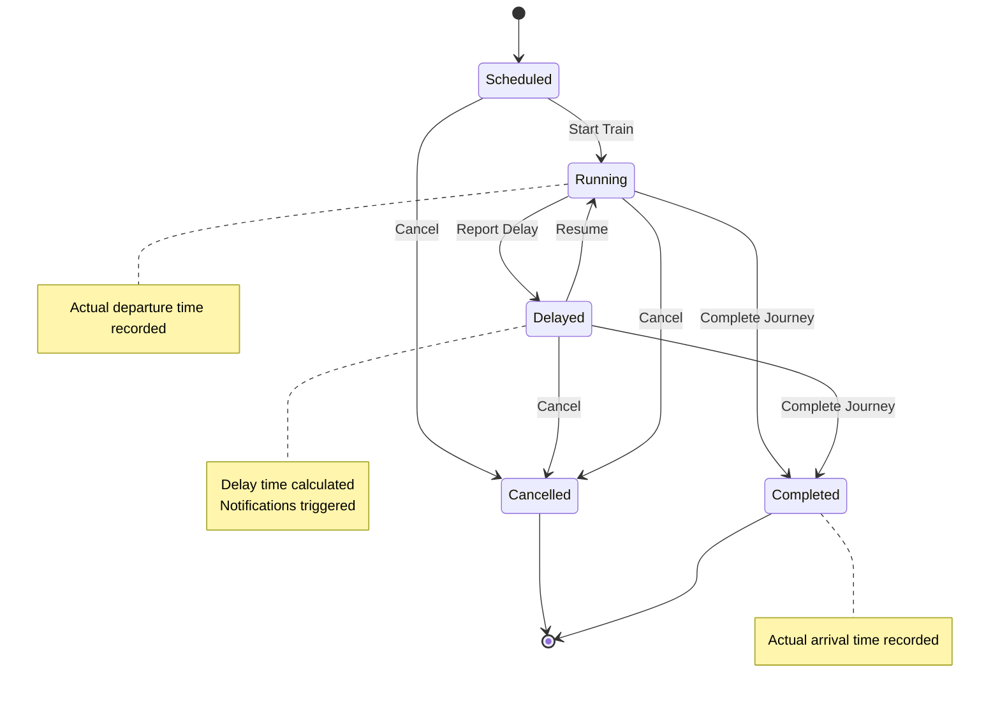

# System Overview

The Railway Operations Management System is a comprehensive platform for managing railway operations, schedules, and real-time monitoring.

## Core Features

### 1. Schedule Management
- Create and manage train schedules with date validation
- Timeline visualization with real-time updates
- Train list view with status indicators
- Excel data import/export capabilities
- Schedule conflict detection and validation
- Support for multiple railway locations (DVD, GDR.KI, NS, BZA, MTM, COA)
- Running days configuration
- Effective date range management

### 2. Real-time Operations
- Live train status updates via WebSocket
- Train control capabilities (Start, Delay, Complete)
- Real-time schedule modifications
- Optimistic UI updates

### 3. Analytics Dashboard
- Train utilization visualization
- Schedule distribution analysis
- Route performance metrics
- Peak hour operations tracking
- Delay tracking statistics

### 4. Access Control
- Role-based authentication (Admin, Operator, Viewer)
- Protected API endpoints
- Secure session management
- Password encryption

## System Requirements
### Schedule State Transitions

### Server Requirements
- Node.js 20.x or higher
- PostgreSQL database
- WebSocket support

### Client Requirements
- Modern web browser with JavaScript enabled
- Support for WebSocket connections

## Technology Stack

### Frontend
- React with TypeScript
- Shadcn UI components
- React Query for data fetching
- Socket.IO client for real-time updates
- Recharts for data visualization
- React Big Calendar for timeline view

### Backend
- Node.js with Express
- PostgreSQL with Drizzle ORM
- Socket.IO for WebSocket connections
- Passport.js for authentication
