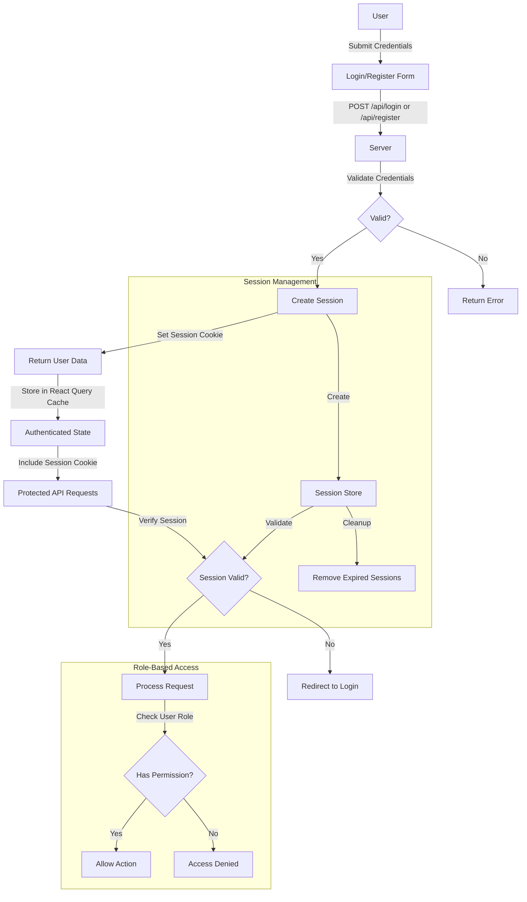

# Security & Authentication

## Authentication System

### Authentication Flow


### Password Security
- Passwords are hashed using scrypt
- Salt is automatically generated
- Timing-safe comparison for password verification

```typescript
const hashedPassword = await crypto.hash(password);
const isValid = await crypto.compare(suppliedPassword, storedPassword);
```

## Role-Based Access Control

### User Roles
1. **Admin**
   - Full system access
   - User management
   - System configuration
   - Analytics access

2. **Operator**
   - Schedule management
   - Train control
   - Basic analytics

3. **Viewer**
   - Read-only access
   - View schedules
   - View analytics

### Permission Matrix

| Feature               | Admin | Operator | Viewer |
|----------------------|-------|----------|--------|
| View Schedules       | ✓     | ✓        | ✓      |
| Create Schedules     | ✓     | ✓        | ✗      |
| Modify Schedules     | ✓     | ✓        | ✗      |
| Delete Schedules     | ✓     | ✗        | ✗      |
| User Management      | ✓     | ✗        | ✗      |
| View Analytics       | ✓     | ✓        | ✓      |
| Export Data          | ✓     | ✓        | ✓      |
| Import Data          | ✓     | ✗        | ✗      |
| Train Control        | ✓     | ✓        | ✗      |

## Session Management

### Session Configuration
```javascript
const sessionConfig = {
  secret: process.env.SESSION_SECRET,
  resave: false,
  saveUninitialized: false,
  cookie: {
    secure: process.env.NODE_ENV === 'production',
    httpOnly: true,
    maxAge: 24 * 60 * 60 * 1000 // 24 hours
  }
};
```

### Session Security Measures
1. HTTP-only cookies
2. Secure flag in production
3. CSRF protection
4. Session expiration
5. Automatic cleanup of expired sessions

## API Security

### Protected Endpoints
- All API routes require authentication
- Role verification middleware
- Rate limiting
- Request validation

### Example Protected Route
```typescript
app.post("/api/schedules",
  requireRole(UserRole.Admin, UserRole.Operator),
  async (req, res) => {
    // Route handler
  }
);
```

## WebSocket Security

### Connection Security
1. Authentication required for connection
2. Session validation
3. Rate limiting for events
4. Event validation

### Secure Event Handling
```typescript
io.use((socket, next) => {
  if (socket.request.session?.passport?.user) {
    next();
  } else {
    next(new Error('Authentication required'));
  }
});
```

## Data Security

### Database Security
1. Prepared statements
2. Input validation
3. Parameter sanitization
4. Schema validation

### Configuration Security
1. Environment Variables
   - Use of secure environment variables for sensitive data
   - Multiple configuration fallback mechanisms
   - Default values for non-sensitive settings
   - Validation of required fields before connection

2. Connection Security
   - Automatic retry mechanism with backoff
   - Connection pooling
   - SSL/TLS enforcement in production
   - Timeout handling

3. Access Control
   - Role-based database user permissions
   - Connection string security
   - Prepared statements to prevent SQL injection
   - Schema-level security

### Example Schema Validation
```typescript
const scheduleSchema = z.object({
  trainId: z.number(),
  departureLocationId: z.number(),
  arrivalLocationId: z.number(),
  scheduledDeparture: z.string(),
  scheduledArrival: z.string()
});
```
## Data Security

### Database Security
1. Prepared statements
2. Input validation
3. Parameter sanitization
4. Schema validation

### Example Schema Validation
```typescript
const scheduleSchema = z.object({
  trainId: z.number(),
  departureLocationId: z.number(),
  arrivalLocationId: z.number(),
  scheduledDeparture: z.string(),
  scheduledArrival: z.string()
});
```

## Security Best Practices

### General Guidelines
1. Keep dependencies updated
2. Regular security audits
3. Input validation on all endpoints
4. Error handling without information leakage
5. Logging of security events

### Error Handling
```typescript
app.use((err, req, res, next) => {
  console.error('[Security]', err);
  res.status(500).json({
    error: 'Internal server error'
  });
});
```

## Security Headers

### Recommended Headers
```typescript
app.use(helmet({
  contentSecurityPolicy: {
    directives: {
      defaultSrc: ["'self'"],
      scriptSrc: ["'self'"],
      styleSrc: ["'self'", "'unsafe-inline'"],
      imgSrc: ["'self'", "data:", "https:"],
      connectSrc: ["'self'", "wss:"]
    }
  },
  referrerPolicy: { policy: 'same-origin' }
}));
```

## Audit Trail

### Logged Events
1. Authentication attempts
2. Permission changes
3. Schedule modifications
4. System configuration changes
5. Data exports/imports

### Audit Log Format
```typescript
interface AuditLog {
  timestamp: Date;
  userId: number;
  action: string;
  resource: string;
  details: object;
  ip: string;
}
```
